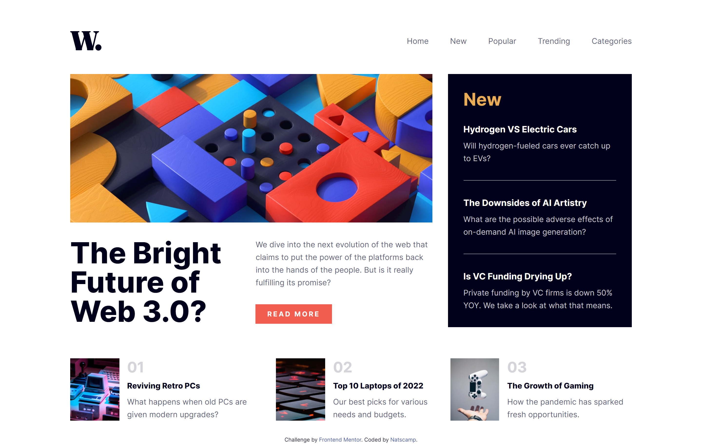

# Frontend Mentor - News homepage solution

This is a solution to the [News homepage challenge on Frontend Mentor](https://www.frontendmentor.io/challenges/news-homepage-H6SWTa1MFl). Frontend Mentor challenges help you improve your coding skills by building realistic projects.

## Table of contents

-   [Overview](#overview)
    -   [The challenge](#the-challenge)
    -   [Screenshot](#screenshot)
    -   [Links](#links)
-   [My process](#my-process)
    -   [Built with](#built-with)
    -   [Continued development](#continued-development)
-   [Author](#author)

## Overview

### The challenge

Users should be able to:

-   View the optimal layout for the interface depending on their device's screen size
-   See hover and focus states for all interactive elements on the page

### Screenshot

### Links

-   Solution URL: [Solution](https://www.frontendmentor.io/solutions/news-homepage-HHMlx0Vp05)
-   Live Site URL: [Live Site](https://news-homepage-challenge-nine.vercel.app/)

## My process

### Built with

-   Semantic HTML5 markup
-   [TailwindCSS](https://tailwindcss.com/)
-   Flexbox
-   CSS Grid
-   Mobile-first workflow

### Continued development

The only part I would want to refine is the mobile menu. Currently, it uses pointer events none to make it non-interactive when it is hidden.

The problem with this is that even though you may not be able to interact with it by clicking or tapping, screen readers can still detect it.

To solve this, you would need to hide or destroy the element after the transitions are finished. This way it cannot be interacted with by either the user or screen readers, whilst still having smooth transitions.

## Author

-   Github - [Nathan1434](https://github.com/Nathan1434)
-   Frontend Mentor - [@Nathan1434](https://www.frontendmentor.io/profile/Nathan1434)
-   LinkedIn - [Nathaniel Campbell](https://www.linkedin.com/in/nathaniel-campbell-wd/)
-   Codepen - [@nathan1434](https://codepen.io/nathan1434)
